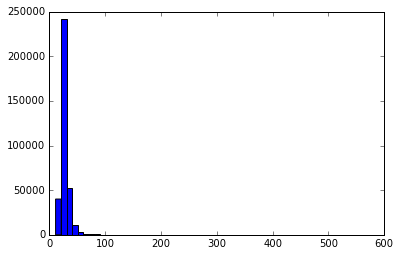
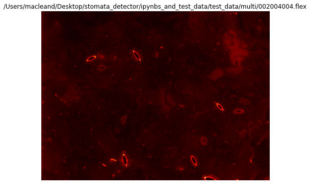
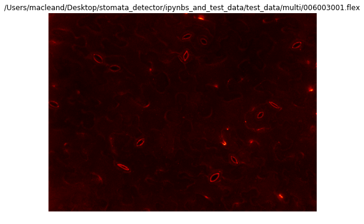
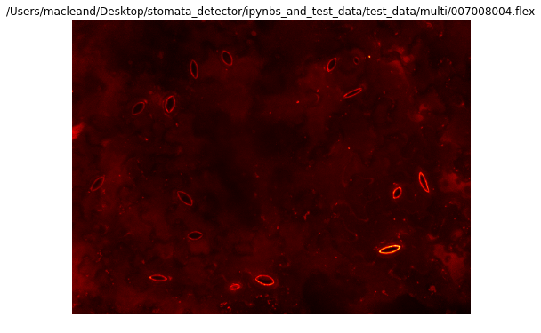
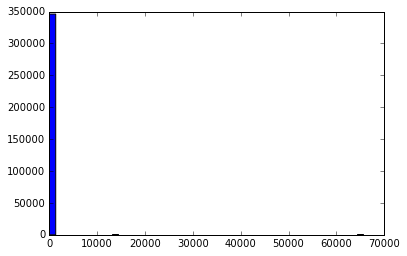
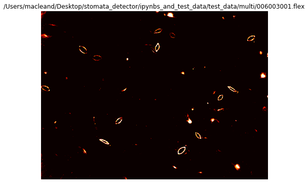
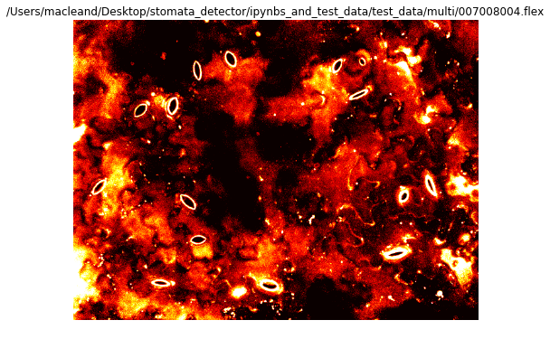

# stomatadetector

A package for detecting and quantifying attributes of stomata objects in fluorescence images in FLEX or TIF format. 

## Installation

This version is on a development 'pore branch' so you'll need to install it manually.

1. From a terminal `git clone https://github.com/TeamMacLean/stomatameasurer.git`
2. `cd` into the created folder. 
3. Run `python setup.py develop`
4. If you have an existing installation of this package, you may need to disable it. You can do that by renaming the package folder:
    1. Start Python in a terminal with `python`
    2. enter: `import stomatadetector as sd`
    3. enter: `print(sd.__file__)` - you should see the location of the package - If it isn't where you cloned the development version to, rename the old package folder.

## Usage

These use examples are written as if run in the Jupyter/iPython Notebook

```python
import stomatadetector as sd
%matplotlib inline

print(sd.__file__) #this should confirm the place the package is being loaded from
```

## 1. Load FLEX files 
### 1.1 Select the folder containing the FLEX files you want to analyse

The first step is to point the notebook at the list of files you want to use. The chooser buttons below will let you pick the folder full of FLEX files. You won't see the FLEX files at this stage. Run the cell below to start.


```python
f = sd.FileBrowser()
f.widget()
```

### 1.2 Load and check the file list
Run this cell to load the list of files into memory, the list will print below.


```python
flex_file_names = sd.GetFlexList(f.path)
flex_file_names
```


    ['/Users/macleand/Desktop/stomata_detector/ipynbs_and_test_data/test_data/multi/002002002.flex',
     '/Users/macleand/Desktop/stomata_detector/ipynbs_and_test_data/test_data/multi/002004004.flex',
     '/Users/macleand/Desktop/stomata_detector/ipynbs_and_test_data/test_data/multi/006003001.flex',
     '/Users/macleand/Desktop/stomata_detector/ipynbs_and_test_data/test_data/multi/007008004.flex']


## 2. Run an analysis

All analysis is done in a single step with `sd.GetStomataObjects` which just needs a list of FLEX file names and a list of options to work and returns a load of objects that represent the analysed leaf image. The image options and segmentation options need to be passed, but can be blank. Running the code below does the analysis and will print out some meta information on the files, including Treatment, Well Coords, Time, Pixel Info and Stack.

`image_options` deal with the parameters for processing the image intensity values. `segment_options` deal with parameters for extracting objects from a processed image.
```python

image_options = [
   # ('gamma',1.25),
    #('median', 2),
    #('gaussian', 1),
    #('rescale', None),
    #('sharpen', 3),
    #('log', 3),
    #('adaptive', 1),
    #('clip', (50,100))

          ]

segment_options = [
    ('pore_percentile', 75),
    ('pore_edge_object_margin', 1),
    ('stomate_max_obj_size', 1000),
    ('stomate_min_obj_size',200)
]

flex_file_names = sd.GetFlexList(f.path)
analysed_flex_files = sd.GetStomataObjects(flex_file_names, image_options=image_options, segment_options=segment_options)


    
```

    /Users/macleand/anaconda/lib/python3.5/site-packages/tifffile/tifffile.py:1974: UserWarning: tags are not ordered by code
      warnings.warn("tags are not ordered by code")


### 2.1 Inspect properties of the images

You can preview the maximum projection of the image and see a histogram of pixel intensities with the `sd.stomataobjects.imshow` and `sd.stomataobjects.imhist` functions. We go over them one at a time with the `for` loop. We'll also show the max and min pixel values of the maximum projection.


```python


for flex in analysed_flex_files:
    sd.stomataobjects.imshow(flex.mp, width=8, height=6, title=flex.flex_file)
    print(flex.mp.min(), flex.mp.max())
    sd.stomataobjects.imhist(flex, bins=50)
    
    
```

    /Users/macleand/anaconda/lib/python3.5/site-packages/tifffile/tifffile.py:1974: UserWarning: tags are not ordered by code
      warnings.warn("tags are not ordered by code")


    11 511








    11 306





    12 471





    23 615


## 2.2 Apply image processing steps

Now we've seen the histograms, we can tell the pixel values for the images go up to 100 and not below 50 in the first three flex files, so lets clip everything under 50 to black and above 100 to 65535 (the max for the image type) so we get good clear intensity values.

The `sd.GetStomataObjects` allows you to pass image manipulation parameters (think of these like Photoshop filters) using a list of options. Below you can see all the image options. Those beginning with `#` won't be applied.


```python

image_options = [
   # ('gamma',1.25),
    #('median', 2),
    #('gaussian', 1),
    #('rescale', None),
    #('sharpen', 3),
    #('log', 3),
    #('adaptive', 1),
    ('clip', (50,100))

          ]


segment_options = [
    ('pore_percentile', 75),
    ('pore_edge_object_margin', 1),
    ('stomate_max_obj_size', 1000),
    ('stomate_min_obj_size',200)
]
analysed_flex_files = sd.GetStomataObjects(flex_file_names, image_options=options)
for flex in analysed_flex_files:
    sd.stomataobjects.imshow(flex.mp, width=8, height=6, title=flex.flex_file)
    print(flex.mp.min(), flex.mp.max())
    sd.stomataobjects.imhist(flex, bins=50)

```

    /Users/macleand/anaconda/lib/python3.5/site-packages/tifffile/tifffile.py:1974: UserWarning: tags are not ordered by code
      warnings.warn("tags are not ordered by code")


    0 65535


    0 65535








    0 65535





    0 65535


### 2.3 Apply pore selection parameters

Finding the pore in the stomates is done by working out what intensity level to take as background. The sub image for each stomate is in the `intensity_image` and you can use the histogram functions to get the information to workout the level for the `percentile` parameter. Everthing lower than the provided percentile is considered non stomate` 

```python
for flex in analysed_flex_files:
    for s flex.stomata_objects:
        i = s.intensity_image
        sd.stomataobjects.imshow(i)
        print(i.min(), i.max())
        sd.stomataobjects.imhist(i)
```

 


## 3 Work with objects


### 3.1 Filter objects

Now we can filter objects based on their properties. This is done with the `sd.stomataobjects.object_filter` function. Again, we do this with a list of options


```python
obj_filter = [
        ('delete_border_objects', True),
        ('max_area', 1000),
        ('min_area', 200),
        ('roundness', 0.65),
        ('width_length', 3)
    
]

for flex in analysed_flex_files:
    sd.stomataobjects.object_filter(flex, obj_filter)
    sd.stomataobjects.imshow(flex.stomata_labels, width=4, height=3)
    sd.stomataobjects.imshow(flex.binary_obj_img, width=4, height=3)

```


## 4. Outputting stomata information
So we get good clean objects. Each object knows stuff about itself so we can produce stomate level reports once we're happy. 

You can print a header with `sd.stomataobjects.report_header()`


```python
print(sd.stomataobjects.report_header() )
for flex in analysed_flex_files:
    for s in flex.stomata_objects:
        print(sd.stomataobjects.custom_report(flex,s))
```

```    
Treatment,PlateRow,PlateColumn,TimeStamp,XUnits,XUnitsPerPixel,YUnits,YUnitsPerPixel,Stack,ObjectCount,ImageStomateIndex,StomateArea,StomateRoundness,StomateLength,StomateWidth,PoreLength,PoreWidth
Col-0,5,11,2015-09-18T11:04:30Z,m,6.459e-007,m,6.459e-007,1,2,1,343,0.692183614553,29.98500644779053,14.671513401361407,None,None
Col-0,5,11,2015-09-18T11:04:30Z,m,6.459e-007,m,6.459e-007,1,2,2,380,0.662305724964,35.72581607461196,13.77566702889869,25.097551160185475,8.175328643249628
```


